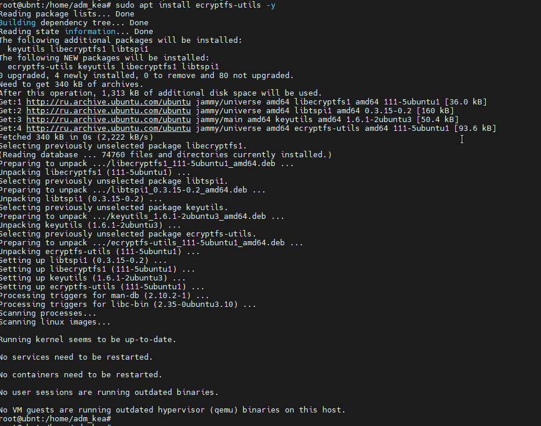
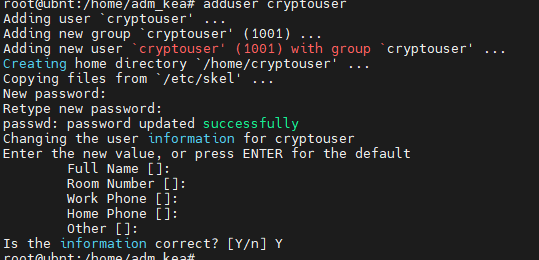
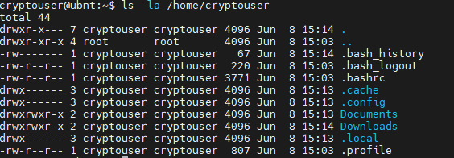
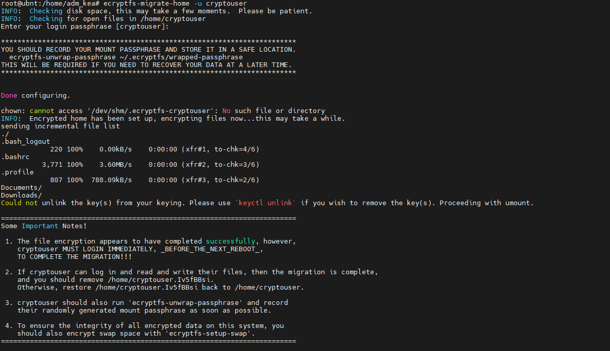
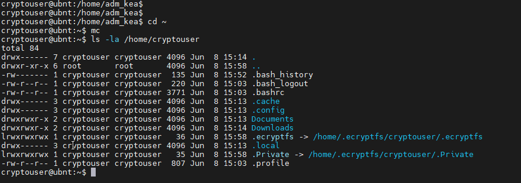
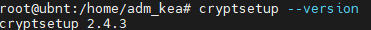
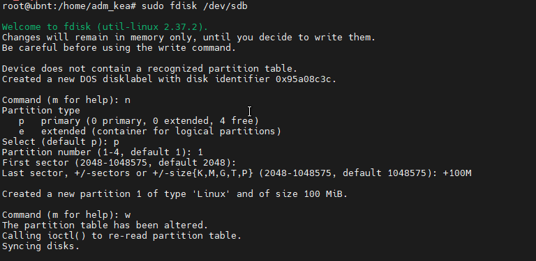
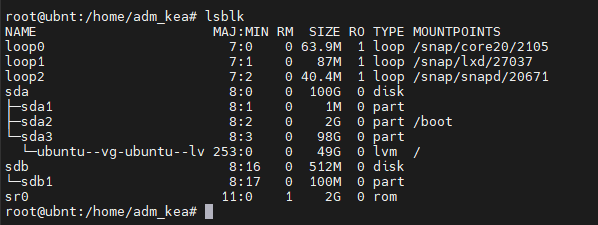
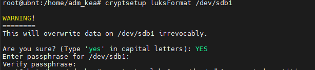
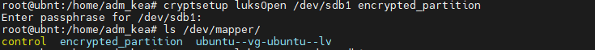

# Домашнее задание к занятию  «Защита хоста» - Крюков Егор

### Задание 1

1. Установите **eCryptfs**.
2. Добавьте пользователя cryptouser.
3. Зашифруйте домашний каталог пользователя с помощью eCryptfs.

*В качестве ответа  пришлите снимки экрана домашнего каталога пользователя с исходными и зашифрованными данными.*  

### Решение
Ниже представлены сркиншоты выполнения задания.

1. Устновка **eCryptfs**.

2. Создание пользователя cryptouser.

3. Вывод команды `ls -la /home/cryptouser` до шифрования.

4. Шифрование

5. Вывод `ls -la /home/cryptouser` после шифрования

---

### Задание 2

1. Установите поддержку **LUKS**.
2. Создайте небольшой раздел, например, 100 Мб.
3. Зашифруйте созданный раздел с помощью LUKS.

*В качестве ответа пришлите снимки экрана с поэтапным выполнением задания.*

### Решение 

Ниже представлены сркиншоты выполнения задания.

- Версия `cryptsetup`

- Создание раздела 100 Мб.

- Раздел создан

- Шифрование раздела

- Результат

